= Cloudera DataFlow - Workshop Student Guide

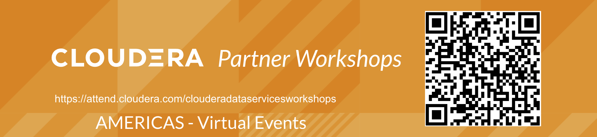

// :toc: left 
'''

Version : 1.0.0 `24th April 2023` +

''' 

== Preface

=== Customer Churn Hands On Lab

==== Objective

In this exercise we will implement an end-to-end machine learning workflow using Cloudera Machine Learning, including: 

. Data ingest 
. Data exploration 
. Model training and experimentation
. Model serving 
. Business applications and 
. MLOps - model operations 

=== Business Use Case

In this Hands On Lab you will create a model to predict customer churn and present model-driven insights to your stakeholders. You will use an interpretability technique to make your otherwise “black box model” explainable in an interactive dashboard. A mathematical explanation is beyond the scope of this lab but if you are interested in learning more we recommend the https://ff06-2020.fastforwardlabs.com/[Fast Forward Labs Report on Model Interpretability]. Finally, you will use basic ML Ops techniques to productionize and monitor your model. 

=== Prerequisites for workshop participants:
- Need to have Workload password set (this will be needed for CDV part where CDW is queried)

=== Environment Setup for workshop:
- Need Impala CDW large enough to support 50 - 100 users hitting it during workshop
- Need table in the DL that contains churn dataset, available to query through CDW above (this is for DataViz)
- Single ML Workspace as the primary working environment 
- *Important!* Ensure that at ML Workspace creation both Model Metrics and Governance features are turned on (they are off by default). 
- Use this document for all preparation
// For 2nd day of workshops, need to recreate the ML Workspace

=== Visual Guide to CML Workshop

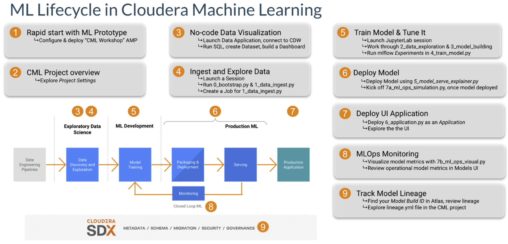

== Lab 1: Configure and deploy the Workshop Content as an https://docs.cloudera.com/machine-learning/cloud/applied-ml-prototypes/topics/ml-amps-overview.html[AMP] (15 min)

AMPs (Applied Machine Learning Prototypes) are reference Machine Learning projects that have been built by Cloudera Fast Forward Labs to provide quickstart examples and tutorials. AMPs are deployed into the Cloudera Machine Learning (CML) experience, which is a platform you can also build your own Machine Learning use cases on.

- Go to the Workshop Environment (provided by instructor)
- Navigate to the Machine Learning tile from the CDP Menu 
- Click into the Workspace by clicking the Workspace name (provided by instructor)

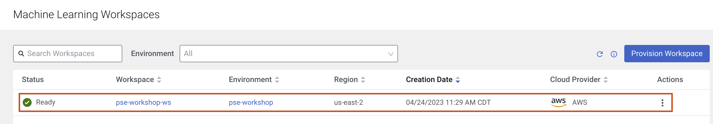

A Workspace is a cluster that runs on a kubernetes service to provide teams of data scientists a platform to develop, test, train, and ultimately deploy machine learning models. It is designed to deploy a small number of infra resources and then autoscale compute resources as needed when end users implement more workloads and use cases.

- Click on *User Settings*
- Go to Environment Variables tab and set your *WORKLOAD_PASSWORD* (provided by instructor).

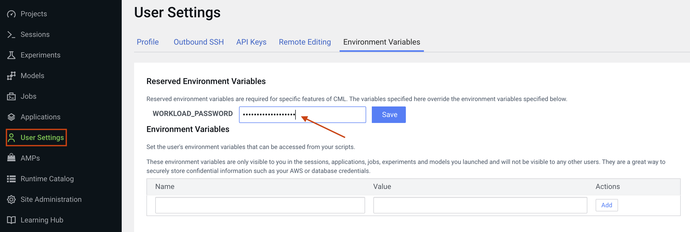

In a workspace, Projects view is the default and you’ll be presented with all public (within your organization) and your own projects, if any. In this lab we will be creating a project based on Applied ML Prototype. 

- Click on *AMPs* in the side panel and search for “workshop”

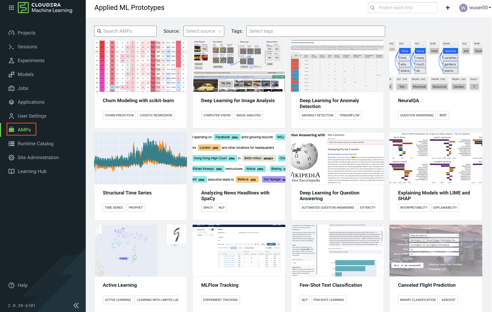

- Click on the AMP card and then on *Configure Project*

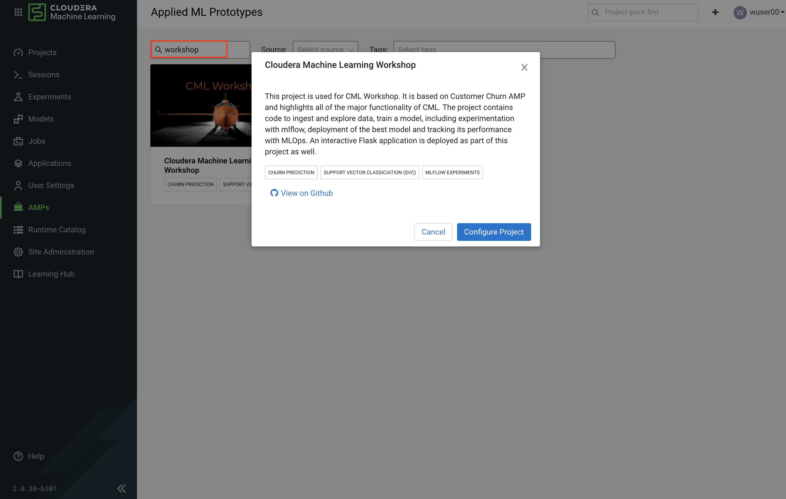

*IMPORTANT* +

* In the Configure Project screen, change the HIVE_TABLE to have a unique suffix. Leave the other environment variables as is. +
+
-- 
** DATA_LOCATION: `data/churn_prototype`
** HIVE_DATABASE: `default`
** HIVE_TABLE: `churn_prototype_<unique username/value>`
--
+
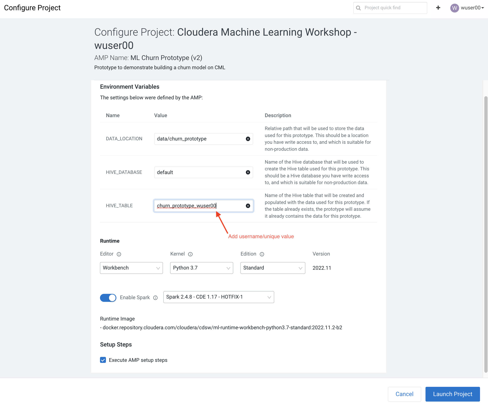

* Click *Launch Project*

*NOTE:* If you see a Warning about runtime mismatch, select the latest available runtime from the dropdown menu.

The latest version of the AMP has been tested for CML Runtimes with Python 3.7 and Spark 2.4.7. If the workspace does not have the exact runtime that was tested you may get a warning. However, you can still deploy the project with other runtimes. For example, you can deploy the project with Spark 2.4.7, CDP 7.2.11, CDE 1.13 HotFix 2.

== Lab2: Churn Model Project Overview (10 min)

* Click on *Overview* on the side panel. On the Project Overview page you will find a listing of Files, as well as a rendering of the README.md 

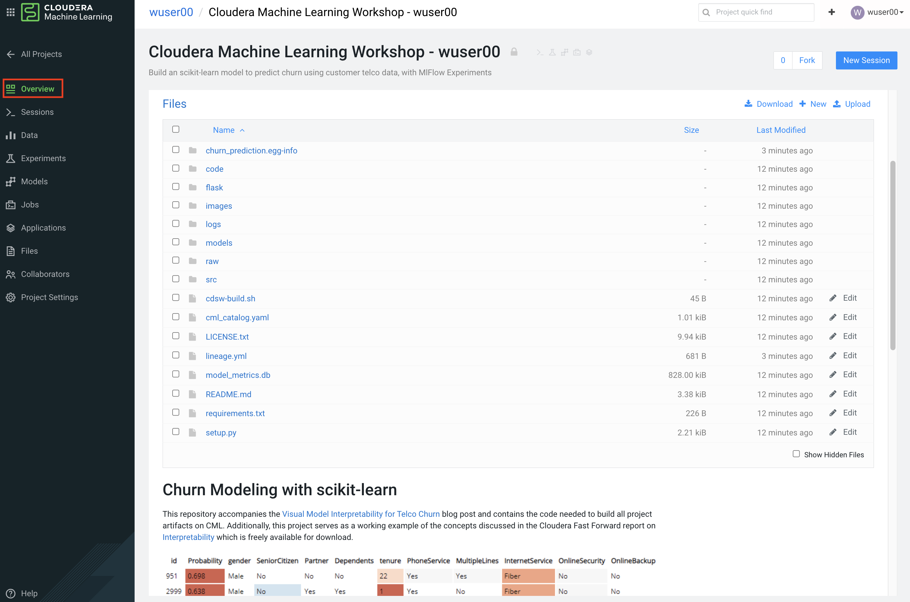

*Collaborators:* +

* Click on *Collaboratos* in the side panel
+
This feature allows teams of Data Scientists, Analysts, and Data Engineers to work together on a given project. 
+
* Ask a colleague for their user ID or use wuser00 and add them as a collaborator with a Viewer role on your project by clicking *Add*
+
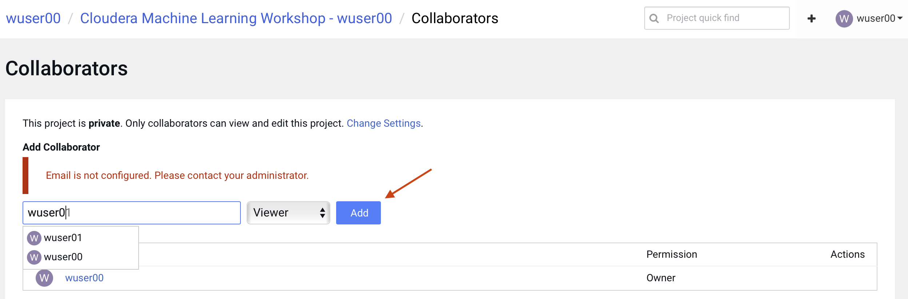
+
You can give access to other users with certain permissions for the encompassing project so teams of users can collaborate together. CML users can also be organized into Teams for ease of management. Consult https://docs.cloudera.com/machine-learning/cloud/projects/topics/ml-adding-collaborators.html[CML documentation] to learn about available roles and their permissions.

*Project Settings:* +

* Click on *Project Settings* in the side panel
+
Taking a look at Project Settings, this is where you can define several options for the current project. You have the ability to define different engines where your code in CML will run. There are project variables that can be defined and used throughout your code. SSH tunnels can also be configured to connect to other services as needed. More details can be found in https://docs.cloudera.com/machine-learning/cloud/projects/topics/ml-projects.html[our docs].

* Change the name of your project to something creative
+
*Please do not change the other Project Settings*
+
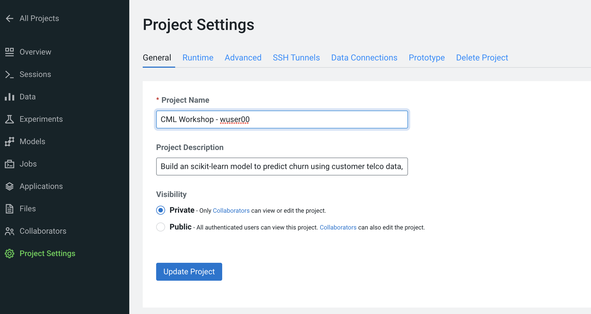

+
This view is also where the project can be deleted, if needed. 

== Lab3: Data Visualization (30 min)

* Click on *Data* in the side panel
* Click on *Launch Data Application*
+
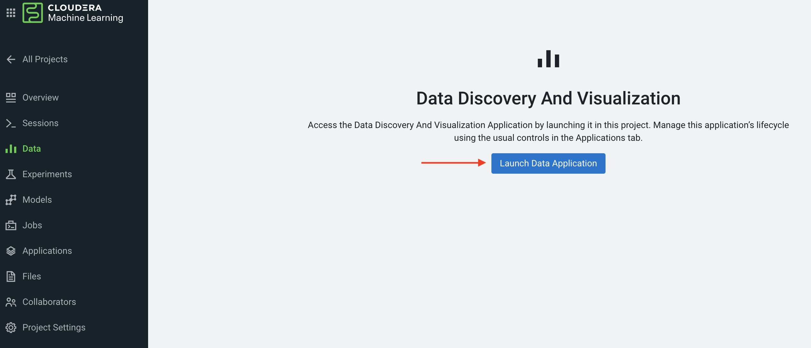

+
https://docs.cloudera.com/data-visualization/7/index.html[Cloudera Data Visualization] (CDV) deployed in CML will take approximately 2 minutes to spin up. It’s a powerful addition to the workflow, as it allows quick access to a SQL interface and visual data exploration without writing any Python code. The data connection points to the central Data Lake which stores all of the enterprise data, giving CML user ability to discover datasets, combine and filter them to uncover new insight. 
+
CDV is deployed as an Application inside of CML. While this application is starting, you can check on its status by clicking on Applications in the side panel. When you see status *Running* you can return to the Data page in the side panel. This is what you should see now:
+
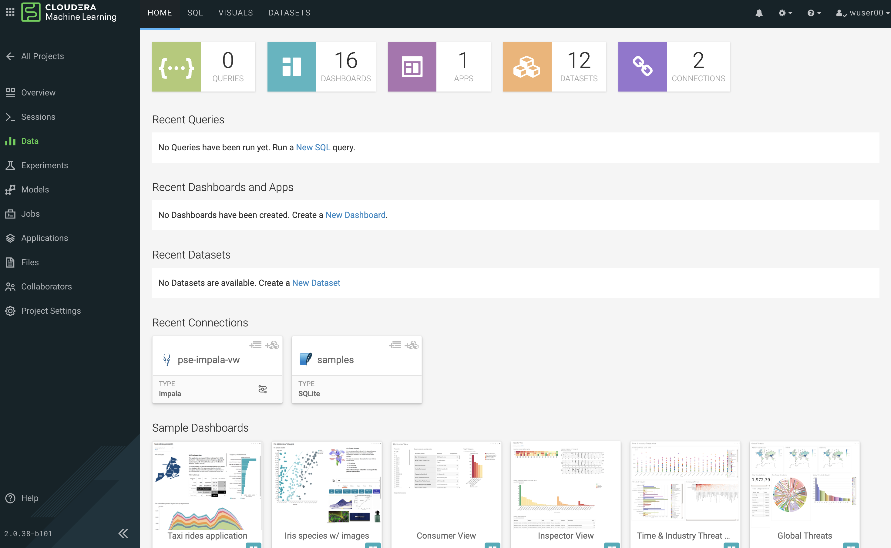
+
From here you can navigate to SQL editor, start building visualizations, or create new datasets.

* Click on *SQL* tab in the top menu
+
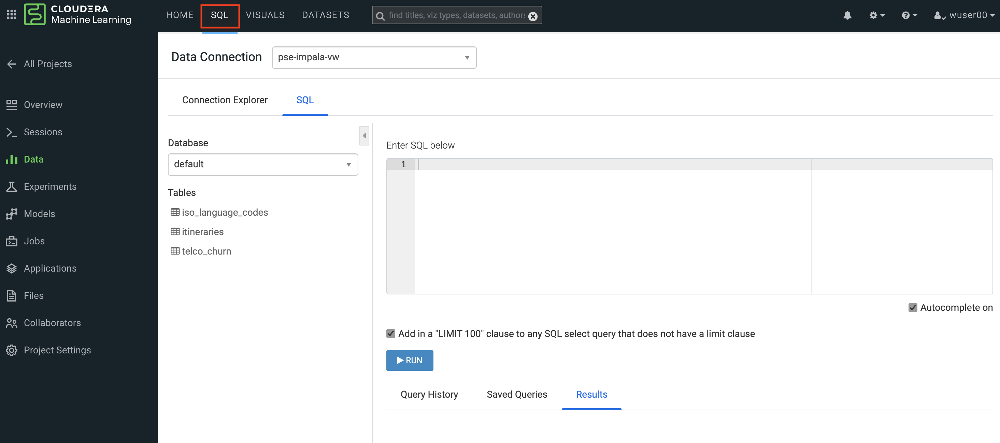
+
NOTE: If you see below error check to make sure your Workload Password is set in CML (see Part 1, p.5). You may need to restart your app to fix this.
+
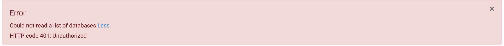

* In *Data Connection* drop down select _pse-impala-vw_ (instructor may provide a different connection)
* Inn the SQL editor enter the query below, the click *RUN* or ⌘+Enter
+
[source, SQL]
----
SELECT  
    COUNT(DISTINCT internetservice) as 'internetservice', 
    COUNT(DISTINCT multiplelines) as 'multiplelines',
    COUNT(DISTINCT contract) as 'contract',
    COUNT(DISTINCT paymentmethod) as 'paymentmethod'
FROM default.churn_prototype;
----
+
The result produced tells us that each categorical variable in this dataset has just a handful of unique values. Any number of table stats analysis can be carried out, including table joins, filtering, etc. For example, below we will limit what data is pulled in to build a dashboard. 

* In the SQL editor replace the previous query with the query below
+
[source, SQL]
----
SELECT * 
FROM default.churn_prototype
WHERE seniorcitizen = "1";
----

* Click *SAVE AS DATASET* button. This will take you to the *DATASETS* tab in the top menu.
+
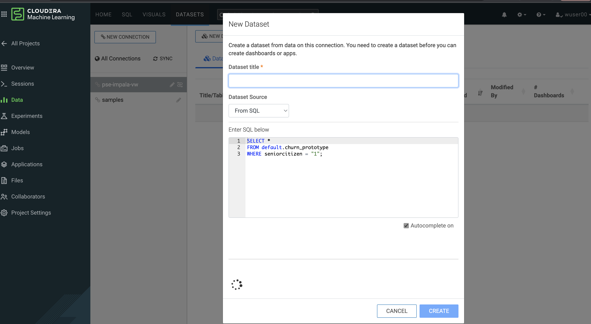

* Give the Dataset a name and click *CREATE*
+
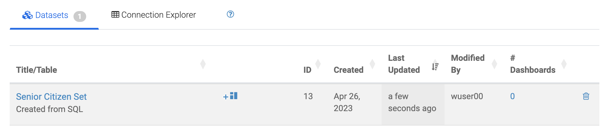
+
In the context of Cloudera Data Visualization, creating a Dataset is defining metadata on top of existing Hive or Iceberg table. The logical Dataset object can then be easily used to build visuals and dashboards fit for decision making or data exploration.

* Click on your Dataset to view what metadata can be applied to it.
+
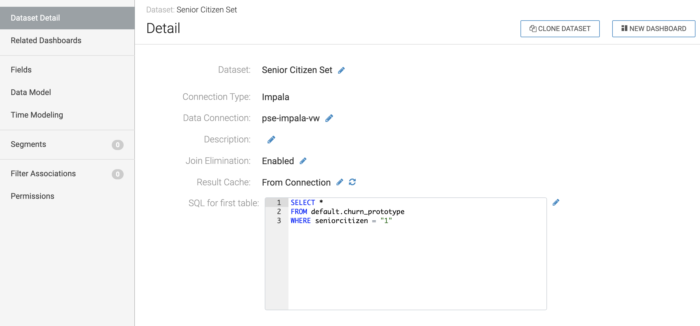
