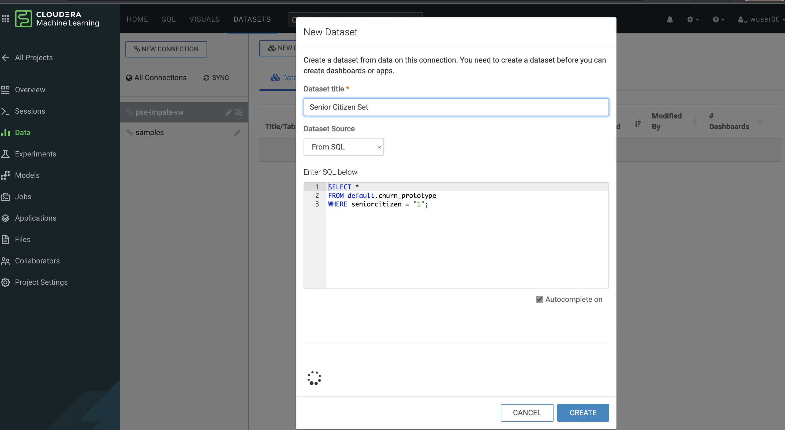

= Cloudera DataFlow - Workshop Student Guide

image::./images/misc/AMERPartnerWSBanner.png[]

// :toc: left 
'''

Version : 1.0.0 `24th April 2023` +

''' 

== Preface

=== Customer Churn Hands On Lab

==== Objective

In this exercise we will implement an end-to-end machine learning workflow using Cloudera Machine Learning, including: 

. Data ingest 
. Data exploration 
. Model training and experimentation
. Model serving 
. Business applications and 
. MLOps - model operations 

=== Business Use Case

In this Hands On Lab you will create a model to predict customer churn and present model-driven insights to your stakeholders. You will use an interpretability technique to make your otherwise “black box model” explainable in an interactive dashboard. A mathematical explanation is beyond the scope of this lab but if you are interested in learning more we recommend the https://ff06-2020.fastforwardlabs.com/[Fast Forward Labs Report on Model Interpretability]. Finally, you will use basic ML Ops techniques to productionize and monitor your model. 

=== Prerequisites for workshop participants:
- Need to have Workload password set (this will be needed for CDV part where CDW is queried)

=== Environment Setup for workshop:
- Need Impala CDW large enough to support 50 - 100 users hitting it during workshop
- Need table in the DL that contains churn dataset, available to query through CDW above (this is for DataViz)
- Single ML Workspace as the primary working environment 
- *Important!* Ensure that at ML Workspace creation both Model Metrics and Governance features are turned on (they are off by default). 
- Use this document for all preparation
// For 2nd day of workshops, need to recreate the ML Workspace

=== Visual Guide to CML Workshop

image::./images/misc/pref/MLlifeCycleinCML.png[]

== Lab 1: Configure and deploy the Workshop Content as an https://docs.cloudera.com/machine-learning/cloud/applied-ml-prototypes/topics/ml-amps-overview.html[AMP] (15 min)

AMPs (Applied Machine Learning Prototypes) are reference Machine Learning projects that have been built by Cloudera Fast Forward Labs to provide quickstart examples and tutorials. AMPs are deployed into the Cloudera Machine Learning (CML) experience, which is a platform you can also build your own Machine Learning use cases on.

- Go to the Workshop Environment (provided by instructor)
- Navigate to the Machine Learning tile from the CDP Menu 
- Click into the Workspace by clicking the Workspace name (provided by instructor)

image::./images/lab1/lab1-1.png[]

A Workspace is a cluster that runs on a kubernetes service to provide teams of data scientists a platform to develop, test, train, and ultimately deploy machine learning models. It is designed to deploy a small number of infra resources and then autoscale compute resources as needed when end users implement more workloads and use cases.

- Click on *User Settings*
- Go to Environment Variables tab and set your *WORKLOAD_PASSWORD* (provided by instructor).

image::./images/lab1/lab1-2.png[]

In a workspace, Projects view is the default and you’ll be presented with all public (within your organization) and your own projects, if any. In this lab we will be creating a project based on Applied ML Prototype. 

- Click on *AMPs* in the side panel and search for “workshop”

- Click on the AMP card and then on *Configure Project*

image::./images/lab1/lab1-4.png[]

*IMPORTANT* +

* In the Configure Project screen, change the HIVE_TABLE to have a unique suffix. Leave the other environment variables as is. +
+
-- 
** DATA_LOCATION: `data/churn_prototype`
** HIVE_DATABASE: `default`
** HIVE_TABLE: `churn_prototype_<unique username/value>`
--
+
image::./images/lab1/lab1-5.png[]

* Click *Launch Project*

*NOTE:* If you see a Warning about runtime mismatch, select the latest available runtime from the dropdown menu.

The latest version of the AMP has been tested for CML Runtimes with Python 3.7 and Spark 2.4.7. If the workspace does not have the exact runtime that was tested you may get a warning. However, you can still deploy the project with other runtimes. For example, you can deploy the project with Spark 2.4.7, CDP 7.2.11, CDE 1.13 HotFix 2.

== Lab2: Churn Model Project Overview (10 min)

* Click on *Overview* on the side panel. On the Project Overview page you will find a listing of Files, as well as a rendering of the README.md 

*Collaborators:* +

* Click on *Collaboratos* in the side panel
+
This feature allows teams of Data Scientists, Analysts, and Data Engineers to work together on a given project. 
+
* Ask a colleague for their user ID or use wuser00 and add them as a collaborator with a Viewer role on your project by clicking *Add*
+

+
You can give access to other users with certain permissions for the encompassing project so teams of users can collaborate together. CML users can also be organized into Teams for ease of management. Consult https://docs.cloudera.com/machine-learning/cloud/projects/topics/ml-adding-collaborators.html[CML documentation] to learn about available roles and their permissions.

*Project Settings:* +

* Click on *Project Settings* in the side panel
+
Taking a look at Project Settings, this is where you can define several options for the current project. You have the ability to define different engines where your code in CML will run. There are project variables that can be defined and used throughout your code. SSH tunnels can also be configured to connect to other services as needed. More details can be found in https://docs.cloudera.com/machine-learning/cloud/projects/topics/ml-projects.html[our docs].

* Change the name of your project to something creative
+
*Please do not change the other Project Settings*
+
image::./images/lab2/lab2-3.png[]

+
This view is also where the project can be deleted, if needed. 

== Lab3: Data Visualization (30 min)

* Click on *Data* in the side panel
* Click on *Launch Data Application*
+
image::./images/lab3/lab3-1.png[]

+
https://docs.cloudera.com/data-visualization/7/index.html[Cloudera Data Visualization] (CDV) deployed in CML will take approximately 2 minutes to spin up. It’s a powerful addition to the workflow, as it allows quick access to a SQL interface and visual data exploration without writing any Python code. The data connection points to the central Data Lake which stores all of the enterprise data, giving CML user ability to discover datasets, combine and filter them to uncover new insight. 
+
CDV is deployed as an Application inside of CML. While this application is starting, you can check on its status by clicking on Applications in the side panel. When you see status *Running* you can return to the Data page in the side panel. This is what you should see now:
+
image::./images/lab3/lab3-2.png[]
+
From here you can navigate to SQL editor, start building visualizations, or create new datasets.

* Click on *SQL* tab in the top menu
+
image::./images/lab3/lab3-3.png[]
+
NOTE: If you see below error check to make sure your Workload Password is set in CML (see Part 1, p.5). You may need to restart your app to fix this.
+

* In *Data Connection* drop down select _pse-impala-vw_ (instructor may provide a different connection)
* Inn the SQL editor enter the query below, the click *RUN* or ⌘+Enter
+
[source, SQL]
----
SELECT  
    COUNT(DISTINCT internetservice) as 'internetservice', 
    COUNT(DISTINCT multiplelines) as 'multiplelines',
    COUNT(DISTINCT contract) as 'contract',
    COUNT(DISTINCT paymentmethod) as 'paymentmethod'
FROM default.churn_prototype;
----
+
The result produced tells us that each categorical variable in this dataset has just a handful of unique values. Any number of table stats analysis can be carried out, including table joins, filtering, etc. For example, below we will limit what data is pulled in to build a dashboard. 

* In the SQL editor replace the previous query with the query below
+
[source, SQL]
----
SELECT * 
FROM default.churn_prototype
WHERE seniorcitizen = "1";
----

* Click *SAVE AS DATASET* button. This will take you to the *DATASETS* tab in the top menu.
+

* Give the Dataset a name and click *CREATE*
+
image::./images/lab3/lab3-6.png[]
+
In the context of Cloudera Data Visualization, creating a Dataset is defining metadata on top of existing Hive or Iceberg table. The logical Dataset object can then be easily used to build visuals and dashboards fit for decision making or data exploration.

* Click on your Dataset to view the metadata information.
+
image::./images/lab3/lab3-7.png[]

* Click on *Fields* menu item in the left-hand panel
* Click on the *EDIT FIELDS* button
+
image::./images/lab3/lab3-8.png[]
* Click the down arrow at the end of the _churn_ Field, and select _Clone_
+
image::./images/lab3/lab3-9.png[]

* Find the Copy of churn Field at the bottom of the Dimensions list and change its type to Mes(ure) and its type from  (string) to (integer).
+

* Click the *SAVE* button
+
There is https://docs.cloudera.com/data-visualization/7/work-with-data/topics/viz-work-with-datasets.html[much more] that can be done with a Dataset, but we will leave it here. Now your Dataset is ready to be used in a Dashboard.

* Click on the *Visual* tab in the top menu
* Click on the *NEW DASHBOARD* button located on the top right
+
You are now presented with a Dashboard building interface. 

* Click on *Visuals* menu item in the right-hand panel, the connection is the same one you used to run your SQL against, and the Dataset you just created. 
+
image::./images/lab3/lab3-11.png[]

* In the right-hand panel click on the *NEW VISUAL* button.
+
By default, CDV will use a table as the starter format. Of course the idea is to use visualization techniques to develop some insight around the dataset, to explore the underlying data, or to develop a user-friendly dashboard for broader consumption.

* Drag the _paymentmethod_ card to the *Dimensions* shelf and _Record Count_ to *Measures* shelf
* Click on the Explore Visuals icon to explore visualization options
+
image::./images/lab3/lab3-12.png[]

* Slect *Horizontal bars* by clicking on the that card
+
Congratulations you just built your first visual in CDV! Now add a couple of more interesting visuals and save your dashboard to conclude this part of the workshop.

* Click on the *Visual* menu item on the right-hand panel and the click on *NEW VISUAL* to add a new visual
* Repeat steps above in this section to build a visual based on other variables and styles
* Give your dashboard a title and a subtitle

Performant SQL interface and visual data exploration are two powerful tools in the arsenal of a Data Professional. One helps to wrangle the data available in the enterprise Data Lakehouse, the other makes it easier to identify patterns and to communicate information to a wider audience.

== LAB4: CML Sessions and Workbench

Sessions allow you to perform actions such as run R, Scala or Python code. They also provide access to an interactive command prompt and terminal. Sessions will be built on a specified Runtime Image, which is a docker container that is deployed onto the ML Workspace. In addition you can specify how much compute you want the session to use.

* Click on the *Overview* menu item in the side panel
* Click on the *New Session* button in the top right corner
+
image::./images/lab4/lab4-1.png[]
+
Before you start a new session you can give it a name, choose an editor (e.g. JupyterLab), what kernel you’d like to use (e.g. latest Python or R), whether you want to make Spark (and hdfs) libraries be available in your session, and finally the resource profile (CPU, memory, and GPU). 

* Ensure that *Enable Spark* add on is enabled
* Leave all other default settings as is and click the *Start Session* button
+
The Workbench is now starting up and deploying a container onto the workspace at this point. Going from left to right you will see the project files, editor pane, and session pane. 
+
Once you see the flashing red line on the bottom of the session pane turn steady green the container has been successfully started.
+
You will be greeted with a pop-up window to get you started connecting to pre-populated Data Lake sources (e.g. virtual Data Warehouses). You could simply copy the code snippet provided and easily connect to, say, a Hive vDW. However, in this lab we won’t be using this feature.

* Check the box *Don't show me this again* and click the *Close* button
+
image::./images/lab4/lab4-2.png[]

*Script 1: Bootstrap File*

* Navigate to _code/0_bootstrap.py_
+
You need to run this at the start of the project. It will install the requirements, create the STORAGE and STORAGE_MODE environment variables and copy the data from WA_Fn-UseC_-Telco-Customer-Churn-.csv into specified path of the STORAGE location, if applicable.

* *Important!* Run All lines in this script 
+

*Script 1: Ingest Data*

* Navigate to _code/1_data_ingest.py_
+
In this script you will ingest a raw csv file into a Spark Dataframe. The script has a .py extension and therefore is ideally suited for execution with the Workbench editor. No modifications to the code are required and it can be executed as is.
+
-- 
** You can execute the entire script in bulk by clicking on the “play icon” on the top menu bar. Once you do this you should notice the editor bar switches from green to red. 
** As an alternative you can select subsets of the code and execute those only. This is great for troubleshooting and testing. To do so, highlight a number of lines of code from your script and then click on “Run” -> “Run Lines” from the top menu bar.
-- 

* *Important!* Run All lines in this script
+
image::./images/lab4/lab4-4.png[]
+
The code is explained in the script comments. However, here are a key few highlights:
+
-- 
** Because CML is integrated with SDX and CDP, you can easily retrieve large datasets from Cloud Storage (ADLS, S3, Ozone) with a simple line of code
** Apache Spark is a general purpose framework for distributed computing that offers high performance for both batch and stream processing. It exposes APIs for Java, Python, R, and Scala, as well as an interactive shell for you to run jobs.
** In Cloudera Machine Learning (CML), Spark and its dependencies are bundled directly into the CML runtime Docker image.
** Furthermore, you can switch between different Spark versions at Session launch.
--

In a real-life scenario, the underlying data may be shifting from week to week or even hour to hour. It may be necessary to run the ingestion process in CML on a recurring basis. Jobs allow any project script to be scheduled to run inside of an ML Workspace compute cluster.

* Click on the *<-Project* menu item in the top panel on the right 
* Click on the *Jobs* in the side panel
* Click *New Job* 
* Give your job a name (e.g. _Ingestion Job_) and select _code/1_data_ingest.py_ as the Script to run
* Toggle the *Enable Spark* button
* Select Recurring as the Schedule from the dropdown and provide daily time for the job to run
+
image::./images/lab4/lab4-5.png[]

